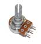
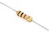

# BOM {#bom}

This is a template for a BOM list.

> The following layout requires the [`layout-tags`](https://github.com/WeMakecc/gitbook-plugin-layout-tags) plugin

It is possible to have BOM list layout with the following syntax:
```

    ../assets/pot.jpg
    10k Potentiometer
    X 5


---


    ../assets/resistor.jpg
    100ohm Resistors
    X 10


---


    ../assets/capacitor.jpg
    4700uF Capacitors
    X 2


---
```

See result:


    ../assets/pot.jpg
    10k Potentiometer
    X 5


---


    ../assets/resistor.jpg
    100ohm Resistors
    X 10


---


    ../assets/capacitor.jpg
    4700uF Capacitors
    X 2


---


**_IMPORTANT_** It is very important to note:
- all tags are needed to be filled and displayed, removing one of the tags would turn into a display error


> It's possible to achieve the same layout without using the `layout-tags` with a table layout:
```markdown
|Item|Description|Quantity|
|-|-|-|
||10k Potentiometer|x 5|
||100ohm Resistor|x 10|
```

See result:
|Item|Description|Quantity|
|-|-|-|
||10k Potentiometer|x 5|
||100ohm Resistor|x 10|


**_IMPORTANT_** It is very important to note:
- don't write any text in the alternative text section of the image as it would break the layout! (eg. please avoid the following markdown ``)


